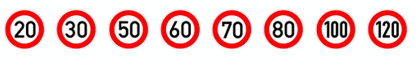
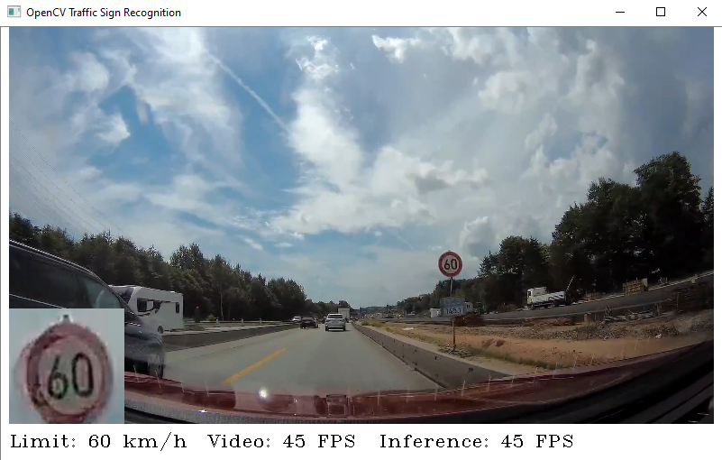

# German Traffic Sign Detection & Classification using OpenCV

Capstone project for the Udacity C++ Nanodegree, which implements real-time traffic sign detection and classification using OpenCV DNN. It can also work with [OpenVino](https://software.intel.com/en-us/openvino-toolkit) on supported hardware, f.ex. an Intel CPU, in order to speed up the inference.

Check out a **demo video** here: https://drive.google.com/open?id=1i8dOdehMpegX_rFVL2zex3DLS1eLs-Db. The program runs in real-time (up to 45FPS on my Intel i5) with CPU only, no GPU used. It could therefore be ported to an embedded System, f.ex. the Jetson Nano.

The system can detect eight different speed limits from the German [GTSRB](http://benchmark.ini.rub.de/?section=gtsrb&subsection=dataset) dataset:

It can run on both a USB webcam in real-time, or on a recorded video file:

To compile the program, either use the Visual Studio project or GCC:

`./compile.sh`

The program can be started with the -r option to record the GUI to a video inside the ./record folder (chunks of one minute), or with -v to use a video file. The camera ID can be changed in the helper.h file, it is zero by default.

For the detection part, I used a pretrained model of SSD_Mobilenet_V1 from [here](https://github.com/aarcosg/traffic-sign-detection). It was trained on the [GTSDB](http://benchmark.ini.rub.de/?section=gtsdb&subsection=dataset) dataset.  For the classification, I used my own model that I created for the SDC Nanodegree from [here](https://github.com/maxritter/SDC-Traffic-Sign-Recognition). 

**Requirements:**

- OpenCV >= 3.4 (4.x also works)
- Optional: OpenVino for speeding up the inference part (compile.sh needs to be adjusted to link the infernce libraries from OpenVino, instead of OpenCV)
- Boost >= 1.68.0